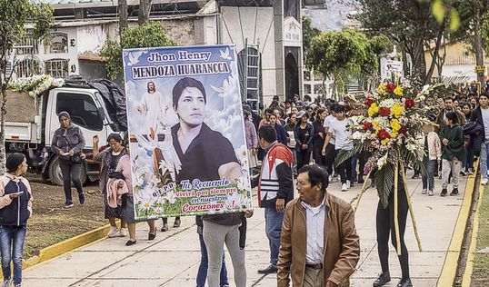

> — Con él he almorzado el día 15 de diciembre, a las dos de la tarde. Luego conversamos y [me dijo ya voy a volver](https://larepublica.pe/sociedad/2022/12/18/dina-boluarte-afirma-que-manifestantes-usaron-hondas-con-ladrillos-y-dinamita-protestas-en-peru-policia-nacional-del-peru/).
>
> Jhovana es hermana mayor de **Jhon Mendoza Huarancca** (34 años). Almorzaron juntos. Tres horas después recibió una llamada con la noticia trágica. ==Ella acudió al hospital. Le dijeron que no estaba. Insistió. Ingresó. Buscó y allí, en una sala, estaba el cuerpo: “como NN”.==
> Le contaron a **Jhovana **que su hermano, al promediar las cinco de la tarde, en medio de los disparos, se tiró en una cuneta. [Un militar se acercó, lo vio y le disparó sin más](https://larepublica.pe/politica/actualidad/2022/12/16/dina-boluarte-presidenta-sobre-fallecidos-en-ayacucho-nuevamente-lamentamos-la-muerte-de-peruanos-protestas-marchas-en-peru-pnp-mdga/).
> **Jhon Mendoza Huarancca** gestionaba con Jhovana una empresa pequeña de **transporte.** Con eso cubría los gastos de dos hermanos menores y se hacía cargo de su madre, una paciente de cáncer terminal. Todo eso antes del disparo en el tórax que acabó con su vida.

- 

> “Con Jhon almorcé el día 15 de diciembre, a las 2:00 p.m. Luego conversamos y me dijo: ‘ya vuelvo’. Tres horas después, me llaman y me dicen que le han disparado. Cuando fui al hospital, me dijeron que no estaba, pero su cuerpo era el NN que habían llevado. Jhon era el segundo de mis cuatro hermanos, con él trabajábamos en una empresa pequeña de transporte. Con eso pagábamos el tratamiento de mi mamá, que tiene cáncer”.
>
> — <cite>Jhovana Mendoza Huarancca, hermana mayor de Jhon Mendoza Huarancca</cite>
